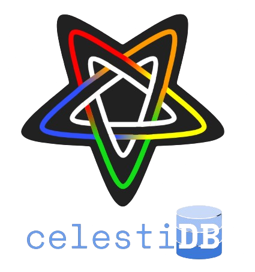

<div align="center">

  [](https://www.gnu.org/licenses/agpl-3.0)

  <br>

  

</div>

### Author: <a href="https://github.com/batcsg1" alt="My GitHub account">Samuel Batchelor</a>

A REST API project designed for managing and accessing data about planets, stars, moons and much more...

## Production REST API on Render 🌐

https://celestidb.onrender.com/api-docs

## How to setup Development environment </>

### 1. Setup - Docker 🐳

If on Windows download [Docker Desktop](https://www.docker.com/products/docker-desktop/)

On Ubuntu/Debian
```bash
sudo apt install docker.io
```

Create a new PostgreSQL database container on Docker (if you haven't already) by running the command below in a terminal:
```
docker run --name celestial-db-postgres -e POSTGRES_PASSWORD=P@ssw0rd -p 5445:5432 -d postgres
```
---

### 2. .env File 🌱
In your `.env` file add these lines:

```
APP_ENV=development
DATABASE_URL="postgresql://postgres:P@ssw0rd@localhost:5445/postgres"
JWT_SECRET=HelloWorld123
JWT_LIFETIME=1hr
```
> Note: If you don't have a `.env` file, create it on the root directory of the repository.

---

### 3. Migrate Schema to Database 🛢️
Run `npm run prisma:migrate` to **migrate** the **schema** located in the `./prisma/schema.prisma` file to your **PostgreSQL** database.

> Note: this will ensure your **schema** is in sync with your **database**

---

### 4. Run Development Mode </>

Run `npm run dev` to start the server in development mode.

This command will run the `dev` script specified in the `package.json` file.

The server will start on port `3000`.

You should see the following in the terminal: 
```
[nodemon] 3.1.9
[nodemon] to restart at any time, enter `rs`
[nodemon] watching path(s): *.*
[nodemon] watching extensions: js,mjs,cjs,json
[nodemon] starting `node app.js`
Server is listening on port 3000. Visit http://localhost:3000/api/v1
```

---

## How to setup Testing environment 🧪

### 1. Setup - Docker 🐳

Create a new PostgreSQL database container on Docker (if you haven't already) by running the command below in a terminal:
```
docker run --name celestial-db-postgres-test -e POSTGRES_PASSWORD=P@ssw0rd -p 5446:5432 -d postgres
```
> Note: Change the local port **5445**:5432 to **5446** to distinguish the testing container from the development container.
---

### 2. .env File 🌱
In your `.env` file add these lines:

```
APP_ENV=testing
DATABASE_URL="postgresql://postgres:P@ssw0rd@localhost:5446/postgres"
JWT_SECRET=HelloWorld123
JWT_LIFETIME=1hr
```
> Note: Once again change the port in the `DATABASE_URL` variable to **5446**

> **Optional:** If you want the testing environment to run on a different server,
> just add the `PORT` variable to the .env file
---

### 3. Migrate Schema to Database 🛢️
Run `npm run prisma:migrate` to **migrate** the **schema** located in the `./prisma/schema.prisma` file to your **PostgreSQL** database.

> Note: this will ensure your **schema** is in sync with your **database**

### Optional. Use Docker Compose to create development and testing environments 🐳

Once you have cloned the repo to your local machine run the following command on the root directory:
```bash
docker compose up -d
```
This will tell the `docker-compose.yml` file to create the **development** and **testing** docker containers simultaneously.

> **Note:** Depending on what container your using, update the envrionment variables within the `.env` accordingly. _(As specified above.)_

> **Important:** If you have any **online** or **offline** Docker containers in your Docker setup using the same port(s) as your development and testing containers, you may have to configure your other containers with different ports. By having the development and testing containers mapped with ports `5445` and `5446`, it ensures they are out of the so called `PostgreSQL` port scope of `5432` or close.

---

## How to seed the PostgreSQL 🫘

Seeding the database will populate it with data. The data will come from seeding scripts located in the `./prisma/seeding` directory of the repository.

There will be seeding files for each database model. Methods for seeding a database include:

1. **Prisma Client**
2. **GitHub Gist**

To seed the database with a data for a particular model run e.g: `npm run prisma:seed-constellations`

## How to run API tests? 🧪
Run `npm run test` to run tests as specified in the testing files within the `tests` directory

The script will reset the database and allow a testing framework called Mocha to run the tests.

When running the tests, you should see the following output:

```
Constellations
    ✔ should reject non-string name
    ✔ should create a valid constellation
    ✔ should create another valid constellation
    ✔ should retrieve all constellations
    ✔ should retrieve a constellation by ID
    ✔ should filter constellations by name
    ✔ should sort constellations by name
    ✔ should reject non-numeric area during update
    ✔ should update a valid constellation
    ✔ should delete a constellation by ID


  10 passing
```
> Note: the **Constellation** tests aren't the only **tests** that will show. There will **more tests** showing once **testing** is implemented for the other database **models**

---

## How to run Prisma Studio 💻
To run **Prisma Studio**, run the following command in a terminal: `npm run prisma:studio`

You should see the following output in your terminal:
```
Environment variables loaded from .env
Prisma schema loaded from prisma\schema.prisma
Prisma Studio is up on http://localhost:5555
```

---

## Entity Relationship Diagram 🛢️



## Video demonstrating functionality of REST API and tests 📹
[Functionality Video](https://otagopoly-my.sharepoint.com/:v:/g/personal/batcsg1_student_op_ac_nz/EcOZ-xio_UlKsBiM42PD6HQBuWGiNhuVMtuEO5BTnvXy4g?e=g4CAl7)

## AI Documentation 🤖
### ChatGPT:

**Implementing the logout logic**

[Issue #13](https://github.com/otago-polytechnic-bit-courses/id607001-s1-25-batcsg1/issues/13)

**Resolved issue where tests of a particular model failed all because the rate limit was reached in one model test.**

[Issue #27](https://github.com/otago-polytechnic-bit-courses/id607001-s1-25-batcsg1/issues/27)

**Resolving problem with shared rate limiting across all routes**

[Issue #77](https://github.com/otago-polytechnic-bit-courses/id607001-s1-25-batcsg1/issues/77)

**Resolving issue during password update where the controller was being bypassed**

Prompt:
```
im getting this: {
  "message": "\"password\" is not allowed"
} instead of the message in here:  if (req.body.password) {
            return res.status(403).json({
                message: "Password updates not allowed here",
            });
        }
```

Response:


✅ Solution
You need to explicitly allow unknown fields in your Joi validation or whitelist allowed fields only and handle password manually in the controller.

Option 1: Allow unknown fields (not ideal for security, but allows controller to handle password)
Update your validator like this:

```js
const schema = Joi.object({
  firstName: Joi.string(),
  lastName: Joi.string(),
  emailAddress: Joi.string().email(),
  homePlanet: Joi.string()
}).unknown(true); // 👈 allows fields not defined in schema (e.g., password)
This way, req.body.password will reach your controller, and your if (req.body.password) check will work as intended.
```

**Making a select object and optional parameter for the generic repository's `getById` and `update` functions**

Prompt:
```
async findById(id, select = {}) {
    return await prisma[this.model].findUnique({
      where: { id },
      select
    });
  } how to make select an optional argument
```
Code response:
```
async findById(id, select) {
  return await prisma[this.model].findUnique({
    where: { id },
    ...(select && Object.keys(select).length > 0 ? { select } : {})
  });
}
```

**Implementing many-to-many relationship for Comets, Asteroids and Meteor Shower models:**
[Issue #7](https://github.com/otago-polytechnic-bit-courses/id607001-s1-25-batcsg1/issues/7)

**Solution to add foreign key IDs to model seeding files:**
[Issue #70](https://github.com/otago-polytechnic-bit-courses/id607001-s1-25-batcsg1/issues/70)

**Explanation for why non-numerical field rejection tests failed:**
[Issue #68](https://github.com/otago-polytechnic-bit-courses/id607001-s1-25-batcsg1/issues/68)


**Prompt for converting Studio 1 Database Schema into Prisma Schema:**

<details>
<summary>Click to expand</summary>

```
CREATE TABLE Stars( 
star_id INTEGER PRIMARY KEY,
star_name text,
star_age real,
star_mass real,
star_diameter real,
star_type text,
star_distance real,
star_temperature real,
star_luminosity real,
number_of_planets integer,
apparent_brightness real,
right_ascension real,
declination real,
constellation_id integer,
foreign key (constellation_id) references Constellations (constellation_id)
);

CREATE TABLE Planets(
planet_id INTEGER PRIMARY KEY,
planet_name text,
planet_age real,
planet_mass real,
planet_diameter real,
planet_density real,
planet_type text,
planet_atmosphere text,
orbital_period real,
minorbital_distance real,
maxorbital_distance real,
axial_tilt real,
number_of_moons integer,
planet_mintemperature real,
planet_maxtemperature real,
planet_gravity real,
rotation_period real,
planet_location text,
planet_habitability text,
star_id integer,
foreign key (star_id) references Stars (star_id)
);

CREATE TABLE Dwarf_Planets(
dwarfplanet_id INTEGER PRIMARY KEY,
dwarfplanet_name text,
dwarfplanet_age real,
dwarfplanet_mass real,
dwarfplanet_diameter real,
dwarfplanet_density real,
dwarfplanet_type text,
dwarfplanet_atmosphere text,
orbital_period real,
minorbital_distance real,
maxorbital_distance real,
axial_tilt real,
number_of_moons integer,
dwarfplanet_mintemperature real,
dwarfplanet_maxtemperature real,
dwarfplanet_gravity real,
rotation_period real,
dwarfplanet_location text,
dwarfplanet_habitability text,
star_id integer,
foreign key (star_id) references Stars (star_id)
);

CREATE TABLE Satellites(
satellite_id INTEGER PRIMARY KEY,
satellite_name text,
satellite_age real,
satellite_mass real,
satellite_diameter real,
satellite_density real,
satellite_type text,
satellite_atmosphere text,
orbital_period real,
minorbital_distance real,
maxorbital_distance real,
axial_tilt real,
satellite_mintemperature real,
satellite_maxtemperature real,
satellite_gravity real,
rotation_period real,
satellite_location text,
satellite_habitability text,
planet_id integer,
dwarfplanet_id integer,
foreign key (planet_id) references Planets (planet_id),
foreign key (dwarfplanet_id) references Dwarf_Planets (dwarfplanet_id)
);

CREATE TABLE Asteroids(
asteroid_id INTEGER PRIMARY KEY,
asteroid_name text,
asteroid_age real,
asteroid_mass real,
asteroid_diameter real,
asteroid_density real,
asteroid_type text,
orbital_period real,
minorbital_distance real,
maxorbital_distance real,
asteroid_location text,
star_id integer,
foreign key (star_id) references Stars (star_id)
);

CREATE TABLE Meteorites(
meteorite_id INTEGER PRIMARY KEY,
meteorite_name text,
meteorite_age real,
meteorite_foundyear integer,
meteorite_mass real,
meteorite_diameter real,
meteorite_location text,
latitudinal_coordinates real,
longitudinal_coordinates real,
planet_id integer,
foreign key (planet_id) references Planets (planet_id)
);

CREATE TABLE Comets(
comet_id INTEGER PRIMARY KEY,
comet_name text,
comet_mass real,
comet_diameter real,
comet_density real,
comet_type text,
orbital_period real,
minorbital_distance real,
maxorbital_distance real,
comet_location text,
star_id integer,
foreign key (star_id) references Stars (star_id)
);

CREATE TABLE Meteor_Showers(
meteorshower_id INTEGER PRIMARY KEY,
meteorshower_name text,
previous_year integer,
next_year integer,
initial_date date,
final_date date,
frequency integer,
meteorshower_duration integer,
meteor_velocity real,
meteors_per_hour integer,
peak_date date,
comet_id integer,
asteroid_id integer,
constellation_id integer,
foreign key (comet_id) references Comets (comet_id),
foreign key (asteroid_id) references Asteroids (asteroid_id),
foreign key (constellation_id) references Constellations (constellation_id)
); Convert all of this to a prisma schema and add it to this schema: // This is your Prisma schema file.
// Learn more about it in the docs: https://pris.ly/d/prisma-schema

// Looking for ways to speed up your queries, or scale easily with your serverless or edge functions?
// Try Prisma Accelerate: https://pris.ly/cli/accelerate-init

generator client {
  provider = "prisma-client-js"
}

datasource db {
  provider = "postgresql"
  url      = env("DATABASE_URL")
}

model Constellation {
  id               String   @id @default(uuid())
  name             String
  right_ascension  Float
  declination      Float
  shape            String
  area             Float
  createdAt        DateTime @default(now())
  updatedAt        DateTime @updatedAt
}
```
</details>

---
**Stars Model controller created from Constellations model:**

<details>
<summary>Click to expand</summary>

```
/**
 * @file Manages business logic for constellations
 * @author Samuel Batchelor
 */

import Repository from "../../repositories/generic.js";

const constellationRepository = new Repository("Constellation");

const selectObject = {
  id: true,
  right_ascension: true,
  declination: true,
  shape: true,
  area: true
};

const createConstellation = async (req, res) => {
  try {
    await constellationRepository.create(req.body);
    const newConstellations = await constellationRepository.findAll(selectObject);
    return res.status(201).json({
      message: "Constellation successfully created",
      data: newConstellations,
    });
  } catch (err) {
    return res.status(500).json({
      message: err.message,
    });
  }
};

const getConstellations = async (req, res) => {
  try {
    const constellations = await constellationRepository.findAll(selectObject);
    if (!constellations) {
      return res.status(404).json({ message: "No constellations found" });
    }
    return res.status(200).json({
      data: constellations,
    });
  } catch (err) {
    return res.status(500).json({
      message: err.message,
    });
  }
};

const getConstellation = async (req, res) => {
  try {
    const constellation = await constellationRepository.findById(req.params.id);
    if (!constellation) {
      return res.status(404).json({
        message: No constellation with the id: ${req.params.id} found,
      });
    }
    return res.status(200).json({
      data: constellation,
    });
  } catch (err) {
    return res.status(500).json({
      message: err.message,
    });
  }
};

const updateConstellation = async (req, res) => {
  try {
    let constellation = await constellationRepository.findById(req.params.id);
    if (!constellation) {
      return res.status(404).json({
        message: No constellation with the id: ${req.params.id} found,
      });
    }
    constellation = await constellationRepository.update(req.params.id, req.body);
    return res.status(200).json({
      message: Constellation with the id: ${req.params.id} successfully updated,
      data: constellation,
    });
  } catch (err) {
    return res.status(500).json({
      message: err.message,
    });
  }
};

const deleteConstellation = async (req, res) => {
  try {
    const constellation = await constellationRepository.findById(req.params.id);
    if (!constellation) {
      return res.status(404).json({
        message: No constellation with the id: ${req.params.id} found,
      });
    }
    await constellationRepository.delete(req.params.id);
    return res.json({
      message: Constellation with the id: ${req.params.id} successfully deleted,
    });
  } catch (err) {
    return res.status(500).json({
      message: err.message,
    });
  }
};

export {
  createConstellation,
  getConstellations,
  getConstellation,
  updateConstellation,
  deleteConstellation,
}; Do all this for stars
```
</details>

---

**Created Stars validation schema from Constellation validation schema:**

<details>
<summary>Click to expand</summary>

```
import Joi from "joi";

const constellationSchema = Joi.object({
  id: Joi.alternatives().try(Joi.string(), Joi.number()).required().messages({
    "string.base": "id should be a string",
    "number.base": "id should be a number",
    "any.required": "id is required"
  }),
  name: Joi.string().min(3).max(100).required().messages({
    "string.base": "name should be a string",
    "string.empty": "name cannot be empty",
    "string.min": "name should have a minimum length of {#limit}",
    "string.max": "name should have a maximum length of {#limit}",
    "any.required": "name is required"
  }),
  right_ascension: Joi.number().required().messages({
    "number.base": "right_ascension should be a number",
    "any.required": "right_ascension is required"
  }),
  declination: Joi.number().required().messages({
    "number.base": "declination should be a number",
    "any.required": "declination is required"
  }),
  shape: Joi.string().min(3).max(100).required().messages({
    "string.base": "shape should be a string",
    "string.empty": "shape cannot be empty",
    "string.min": "shape should have a minimum length of {#limit}",
    "string.max": "shape should have a maximum length of {#limit}",
    "any.required": "shape is required"
  }),
  area: Joi.number().min(0).required().messages({
    "number.base": "area should be a number",
    "number.min": "area should be greater than or equal to {#limit}",
    "any.required": "area is required"
  }),
});

const validateSchema = (schema, isRequired = false) => {
  return (req, res, next) => {
    const { error } = isRequired
      ? schema.required().validate(req.body)
      : schema.validate(req.body);

    if (error) {
      return res.status(409).json({
        msg: error.details[0].message,
      });
    }

    next();
  };
};

const validatePostConstellation = validateSchema(constellationSchema, true);
const validatePutConstellation = validateSchema(constellationSchema);

export { validatePostConstellation, validatePutConstellation };  validation for stars
```
</details>

---

**Created Stars route file based on Constellation route file:**

<details>
<summary>Click to expand</summary>

```
/**
 * @file Defines the route for getting the constellations data
 * @author Samuel Batchelor
 */

import createRouter from "./base.js";

import {
  createConstellation,
  getConstellations,
  getConstellation,
  updateConstellation,
  deleteConstellation,
} from "../../controllers/v1/constellation.js";

import {
  validatePostConstellation,
  validatePutConstellation,
} from "../../middleware/validation/constellation.js";

const constellationController = {
  get: getConstellations,
  getById: getConstellation,
  create: createConstellation,
  update: updateConstellation,
  delete: deleteConstellation,
};

const constellationRouter = createRouter(
  constellationController,
  validatePostConstellation,
  validatePutConstellation,
);

export default constellationRouter; do this for stars too
```
</details>

---

**Creating Swagger documentation for Stars based off documentation for Constellations:**

<details>
<summary>Click to expand</summary>

```
/**
 * @swagger
 * components:
 *   schemas:
 *     Constellation:
 *       type: object
 *       properties:
 *         id:
 *           type: string
 *           format: uuid
 *           example: "123e4567-e89b-12d3-a456-426614174000"
 *         name:
 *           type: string
 *           example: Orion
 *         right_ascension:
 *           type: number
 *           format: float
 *           example: 5.5
 *         declination:
 *           type: number
 *           format: float
 *           example: -5.0
 *         shape:
 *           type: string
 *           example: "Hunter"
 *         area:
 *           type: number
 *           format: float
 *           example: 594.0
 */

/**
 * @swagger
 * /api/v1/constellations:
 *   post:
 *     summary: Create a new constellation
 *     tags:
 *       - Constellation
 *     requestBody:
 *       required: true
 *       content:
 *         application/json:
 *           schema:
 *             $ref: '#/components/schemas/Constellation'
 *     responses:
 *       '201':
 *         description: Constellation successfully created
 *       '400':
 *         description: Constellation with the same name already exists
 *       '500':
 *         description: Internal server error
 */

/**
 * @swagger
 * /api/v1/constellations:
 *   get:
 *     summary: Get all constellations
 *     tags:
 *       - Constellation
 *     responses:
 *       '200':
 *         description: Success
 *       '404':
 *         description: No constellations found
 *       '500':
 *         description: Internal server error
 */

/**
 * @swagger
 * /api/v1/constellations/{id}:
 *   get:
 *     summary: Get a constellation by id
 *     tags:
 *       - Constellation
 *     parameters:
 *       - in: path
 *         name: id
 *         required: true
 *         schema:
 *           type: integer
 *     responses:
 *       '200':
 *         description: Success
 *       '404':
 *         description: No constellation found with the provided id
 *       '500':
 *         description: Internal server error
 */

/**
 * @swagger
 * /api/v1/constellations/{id}:
 *   put:
 *     summary: Update a constellation by id
 *     tags:
 *       - Constellation
 *     parameters:
 *       - in: path
 *         name: id
 *         required: true
 *         schema:
 *           type: integer
 *     requestBody:
 *       required: true
 *       content:
 *         application/json:
 *           schema:
 *             $ref: '#/components/schemas/Constellation'
 *     responses:
 *       '200':
 *         description: Constellation successfully updated
 *       '404':
 *         description: No constellation found with the provided id
 *       '500':
 *         description: Internal server error
 */

/**
 * @swagger
 * /api/v1/constellations/{id}:
 *   delete:
 *     summary: Delete a constellation by id
 *     tags:
 *       - Constellation
 *     parameters:
 *       - in: path
 *         name: id
 *         required: true
 *         schema:
 *           type: integer
 *     responses:
 *       '200':
 *         description: Constellation successfully deleted
 *       '404':
 *         description: No constellation found with the provided id
 *       '500':
 *         description: Internal server error
 */  update swagger for stars
```

</details>

---
